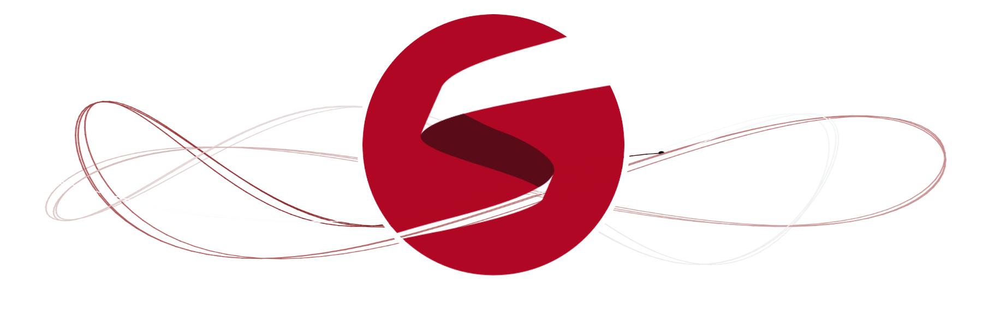

```{r setup, include=FALSE}
knitr::opts_chunk$set(echo = TRUE)
```

<style>
h3 {
  font-size: 110%;
  color: #993333;
}

h4 {
  font-size: 105%;
}
</style>



## Workshop Materials


* [Workshop Participants](https://docs.google.com/document/d/1bZkLAZqAhwgsyZS0HO8_YLU0Li97LxNqBZYgXCZNRQw/edit?usp=sharing)

* [**Questions/Comments/Answers/Responses**](https://docs.google.com/document/d/1Cfpq9_lg1ShZpinBYWqtzb6OsE5LKdbljrsJYvwaqNU/edit?usp=sharing).  

    Use this google doc to comment or ask questions.  Feel free to respond to other people's questions.

### Slides

* [Stan and Workflow](course-materials/slides/stan-and-workflow.pdf)
* [Stan R Ecosystem](course-materials/slides/stan-r-ecosystem.pdf)


### Main R markdown document

* [Pest_Control_Example.Rmd](/course-materials/Pest_Control_Example.Rmd)

### Data Sets

Put these in a folder called `data`: 

* [pest_data.RDS](/course-materials/data/pest_data.RDS)
* [pest_data_longer_stan_dat.RDS](/course-materials/data/pest_data_longer_stan_dat.RDS)

### Stan Programs

Put these in a folder called `stan_programs`: 

* [multiple_NB_regression_dgp.stan](course-materials/stan_programs/multiple_NB_regression_dgp.stan)
* [multiple_poisson_regression_dgp.stan](course-materials/stan_programs/multiple_poisson_regression_dgp.stan)
* [simple_poisson_regression.stan](course-materials/stan_programs/simple_poisson_regression.stan)
* [simple_poisson_regression_dgp.stan](course-materials/stan_programs/simple_poisson_regression_dgp.stan)

## Other Stan Resources

Additional resources will be posted here.

### Jonah's Reading List

* [Jonah's GitHub](https://github.com/jgabry)
* [Visualization in Bayesian Workflow](https://github.com/jgabry/bayes-vis-paper)
* More later in the workshop

### Teaching Resources

---

## Dates and Location

Calvin College will be hosting a Stan (+R) workshop **June 10-12**.
Sessions will begin each day at 9 am and conclude at 4 pm.  Lunch and
mid-session refreshments will be provided.

Calvin College is located in Grand Rapids, MI.  [Campus Map](https://calvin.edu/map/?place=north-hall)

There should be ample **parking** in lots 4 or 5 (the closest to North Hall).
[Parking Lot Map](https://calvin.edu/dotAsset/f8ae2d6c-94f1-46e4-9618-4b518810b88a.pdf)

## Before You Arrive

To get the most out of the workshop, come with a laptop ready to use RStudio and
Stan. (Let the organizers know ASAP if you do not have a laptop you can bring
and we will see if we can find something for you to borrow.)  Here's is what
should be on your laptop.

  * A recent version of RStudio (1.2.x or later)
  * A recent version of R
  * A recent version of Stan (version 2.18.0 or above).
      * Detailed Instructions for this are at 
      <https://github.com/stan-dev/rstan/wiki/RStan-Getting-Started>
      * You can test your configuration by running one of the demo models.
      * If you have trouble, post on the (friendly) Stan forums
      <https://discourse.mc-stan.org> and get help before coming to the
      workshop.
  * The following R packages
  
    ```{r eval = FALSE}
    packages <- c('bayesplot', 'loo', 'shinystan', 'rstanarm', 
                  'brms', 'lubridate',  'rmarkdown', 'tidyverse')
    install.packages(packages)
    ````            


## Target Audience

The target audience is faculty and other researchers, either
teachers or practitioners of applied statistics.

## Registration

Limited space is available for this workshop. Registration via EventBrite is available
at <https://calvin-stan-workshop.eventbrite.com>.

**Update:** We are sold out, but we are maintaining a waiting list.

## Workshop Description

This **three-day workshop** will provide an introduction to using Stan for
Bayesian data analysis. 

### What is Stan?

[Stan®](https://mc-stan.org/) is a state-of-the-art 
platform for statistical
modeling and high-performance statistical computation. Users specify log density
functions in Stan’s probabilistic programming language and get:

* full Bayesian statistical inference with MCMC sampling (NUTS, HMC)

* approximate Bayesian inference with variational inference (ADVI)

* penalized maximum likelihood estimation with optimization (L-BFGS)

Workshop sessions will include information on designing models, choosing priors,
describing models in the Stan language, detecting and addressing potential
problems with the HMC sampler, and interpreting results.  Our primary interface
to Stan will be via R and RStudio, but participants should be able to transfer
skills to other interfaces, including python.  Ample hands-on time will be
provided with guided activities to give participants experience using Stan.  No
prior experience with Stan is required.

### Presenters

Our lead presenter will be **Jonah Sol Gabry**.  Jonah is a member of the Stan core
development team and a researcher in statistics working with Andrew Gelman on
methods and software for Bayesian data analysis. He is co-author of the 
[rstan](http://mc-stan.org/interfaces/rstan.html)
and [rstanarm](http://mc-stan.org/interfaces/rstanarm.html)
R packages, which provide interfaces to Stan, as well as author and
maintainer of the 
[shinystan](http://mc-stan.org/interfaces/shinystan) and 
[bayesplot](http://mc-stan.org/interfaces/bayesplot) 
packages  for model visualization, and
the [loo](http://mc-stan.org/interfaces/loo.html)
R package for model comparison. Jonah is also affiliated with the
Columbia Population Research Center, where he advises on statistical issues
related to collection and analysis of survey data.

Joining Jonah will be **Vianey Leos Barajas**.
Vianey is a statistician who does research in the area of statistical ecology,
with a primary focus on time series modeling of animal movement data. She
currently uses Stan to model shark and elasmobranch data in collaboration with
the [MigraMar](http://migramar.org/hi/en/) group.

## Lodging and Transportation

Participants from out of town can choose to stay at the 
[Prince Conference Center](https://calvin.edu/offices-services/prince-conference-center/accommodations/) ($129 + tax per night) on Calvin's campus (mention the Stan Workshop when
reserving your room) or at one of 
[many nearby hotels](https://www.google.com/maps/search/hotels+near+calvin+college/@42.92019,-85.5748815,14z). 

The Gerald R. Ford International Airport (GRR) is located approximately 6 miles
from campus. The Prince Conference Center provides shuttle service to/from the
airport for guests who request this in advance.

## Sponsors

This workshop is made possible by the 
**Vos Endowment for Excellence in Mathematics and Statistics** 
of **Calvin College** and through support of the
**Department of Statistics** at **Grand Valley State University**.


